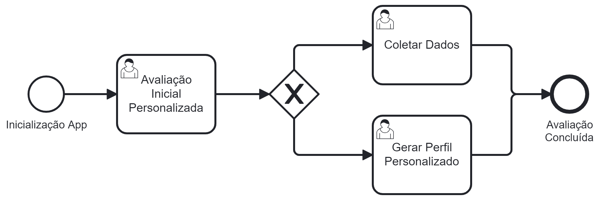

### 3.3.1 Processo 1 – Avaliação Inicial Personalizada

Este processo envolve  uma avaliação inicial detalhada do usuário, entendendo seus objetivos de treinamento, treinos anteriores e quaisquer limitações físicas. Além disso, são coletadas informações relevantes, como  nível  de condicionamento físico atual, preferências individuais de exercícios e  disponibilidade de tempo. Com base nesta informação, é criado um perfil pessoal para orientar a criação de planos de treino personalizados. Este perfil tem em conta todas estas variáveis, garantindo que os planos de treino são cuidadosamente adaptados às necessidades específicas de cada utilizador, otimizando  o sucesso e a eficácia do programa de treino.

#### Detalhamento das atividades

* **Atividade 1 - Avaliação Inicial**: Realizar uma avaliação inicial do usuário, incluindo objetivos, histórico de treinamento e restrições físicas.
* **Atividade 2 - Coleta de Dados**: Coletar dados sobre nível de condicionamento, preferências de treino e disponibilidade de tempo.
* **Atividade 3 - Perfil Personalizado**: Gerar um perfil personalizado que guiará a criação de planos de treinamento específicos.

Os tipos de dados a serem utilizados são:

* **Área de texto** - campo texto de múltiplas linhas
* **Caixa de texto** - campo texto de uma linha
* **Número** - campo numérico
* **Data** - campo do tipo data (dd-mm-aaaa)
* **Hora** - campo do tipo hora (hh:mm:ss)
* **Data e Hora** - campo do tipo data e hora (dd-mm-aaaa, hh:mm:ss)
* **Imagem** - campo contendo uma imagem
* **Seleção única** - campo com várias opções de valores que são mutuamente exclusivos (tradicional radio button ou combobox)
* **Seleção múltipla** - campo com várias opções que podem ser selecionadas mutuamente (tradicional checkbox ou listbox)
* **Arquivo** - campo de upload de documento
* **Link** - campo que armazena uma URL
* **Tabela** - campo formado por uma matriz de valores

**Avaliação Inicial**

| **Campo**       | **Tipo**         | **Restrições** | **Valor default** |
| ---             | ---              | ---            | ---               |
| Objetivos                | Seleção múltipla | Escolher apenas os campos que representam os objetivos 					| Selecione os seus objetivos  |
| Histórico de Treinamento | Seleção única | Escolher apenas o campo que representa melhor o histórico de treino 			| Selecione o seu histórico de treino |
| Restrições Físicas 	   | Seleção única | Escolher apenas o campo que representa as restrições físicas ou se não possui nenhuma | Selecione suas restrições físicas |

| **Comandos**         |  **Destino**                   | **Tipo** |
| ---                  | ---                            | ---               |
| Cadastrar            | Realiza o proceso de cadastro da avaliação inicial | --- |

**Coleta de dados**

| **Campo**       | **Tipo**         | **Restrições** | **Valor default** |
| ---             | ---              | ---            | ---               |
| Nível de condicionamento | Seleção única     | Escolher apenas o campo que representa o seu nível atual de condicionamento físico | Selecione seu nível de condicionamento |
| Preferências de Treino   | Seleção múltipla  | Escolher os campos que representam as preferências de treino                       | Selecione suas preferências |
| Disponibilidade de Tempo | Data e Hora       | Escolher a faixa de horário e dia que possui disponibilidade                       | Escolha sua disponibilidade |

| **Comandos**         |  **Destino**                   | **Tipo**          |
| ---                  | ---                            | ---               |
| Cadastrar            | Realiza o proceso de cadastro dos dados pessoais   | --- |

**Perfil Personalizado**

| **Campo**       | **Tipo**         | **Restrições** | **Valor default** |
| ---             | ---              | ---            | ---               |
| Perfil | Link | --- | --- |

| **Comandos**         |  **Destino**                   | **Tipo**          |
| ---                  | ---                            | ---               |
| Visualizar Perfil    | Redireciona até a página do perfil personalizado   | --- |
