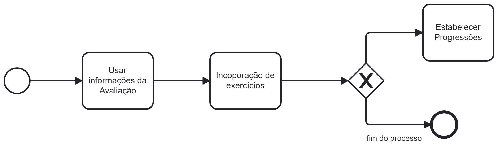

### 3.3.2 Processo 2 – Criação de Planos de Treino Personalizados

Este processo utiliza as informações coletadas durante a avaliação inicial  para criar planos de exercícios altamente personalizados. Esses planos são cuidadosamente adaptados aos objetivos individuais do usuário e incluem muitos exercícios que visam diretamente objetivos como crescimento muscular, perda de peso ou resistência. Além disso, aumentos graduais de intensidade e dificuldade são implementados ao longo do tempo para evitar a estagnação e garantir que o treino continue desafiador e eficaz.

#### Detalhamento das atividades

* **Atividade 1 - Criação de Plano de Treino**: Usar as informações da avaliação inicial para criar planos de treino sob medida.
* **Atividade 2 - Incorporação de Exercícios**: Incorporar uma variedade de exercícios que visem os objetivos do usuário, como ganho de massa muscular, perda de peso ou aumento da resistência.
* **Atividade 3 - Estabelecer Progressões**: Estabelecer progressões de intensidade e dificuldade ao longo do tempo para evitar estagnação.

Os tipos de dados a serem utilizados são:

* **Área de texto** - campo texto de múltiplas linhas
* **Caixa de texto** - campo texto de uma linha
* **Número** - campo numérico
* **Data** - campo do tipo data (dd-mm-aaaa)
* **Hora** - campo do tipo hora (hh:mm:ss)
* **Data e Hora** - campo do tipo data e hora (dd-mm-aaaa, hh:mm:ss)
* **Imagem** - campo contendo uma imagem
* **Seleção única** - campo com várias opções de valores que são mutuamente exclusivos (tradicional radio button ou combobox)
* **Seleção múltipla** - campo com várias opções que podem ser selecionadas mutuamente (tradicional checkbox ou listbox)
* **Arquivo** - campo de upload de documento
* **Link** - campo que armazena uma URL
* **Tabela** - campo formado por uma matriz de valores

**Criação de Plano de Treino**

| **Campo**       | **Tipo**         | **Restrições** | **Valor default** |
| ---             | ---              | ---            | ---               |
| Plano de Treino | Imagem | --- | --- |

| **Comandos**         |  **Destino**                   | **Tipo** |
| ---                  | ---                            | ---               |
| Gerar Plano de Treino | Gera o plano de treino personalizado e o exibe em um campo de imagens | --- |

**Incorporação de Exercícios**

| **Campo**       | **Tipo**         | **Restrições** | **Valor default** |
| ---             | ---              | ---            | ---               |
| Ganho de Massa Muscular | Caixa de texto | Aceita apenas números | Informe quanto ganhou de massa muscular |
| Perda de Peso   | Caixa de texto | Aceita apenas números | Informe quanto perdeu de peso |
| Aumento da Resistência | Seleção única | Escolher apenas o campo que representa o aumento da resistência | Selecione o aumento da resistência |

| **Comandos**         |  **Destino**                   | **Tipo**          |
| ---                  | ---                            | ---               |
| Cadastrar Informações| Atualiza as informações do plano de treino | --- |

**Estabelecer Progressões**

| **Campo**       | **Tipo**         | **Restrições** | **Valor default** |
| ---             | ---              | ---            | ---               |
| Progressões de Intensidade | Seleção única | Escolher apenas o campo que representa o desejo da progressão de intensidade | Selecione uma progressão de intensidade |
| Progressões de Dificuldade | Seleção única | Escolher apenas o campo que representa o desejo da progressão de dificuldade | Selecione uma progressão de intensidade |

| **Comandos**         |  **Destino**                   | **Tipo**          |
| ---                  | ---                            | ---               |
| Visualizar Progressão    | Atualiza o plano de treino com as progressões  | --- |
