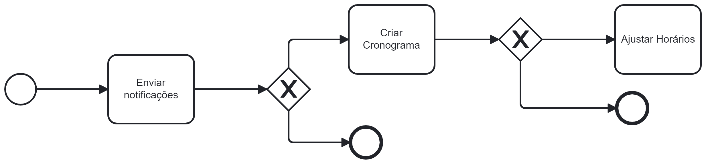

### 3.3.4 Processo 4 – *Lembretes e Planejamento de Treinos:*

Descrição: Este processo visa melhorar a experiência dos usuários ao enviar lembretes de treinos agendados, oferecer opções de planejamento flexíveis e permitir ajustes de horários de acordo com a disponibilidade individual.

#### Detalhamento das atividades

Atividade 1-Enviar notificações para lembrar os usuários sobre os treinos agendados: O aplicativo enviará notificações personalizadas para lembrar os usuários de seus treinos agendados. Essas notificações podem ser configuradas de acordo com as preferências do usuário, seja com antecedência ou no momento do treino.

Atividade 2-Oferecer a opção de criar um cronograma semanal ou mensal de treinamentos: Os usuários podem criar um plano de treinamento personalizado escolhendo exercícios, dias da semana e duração. O aplicativo ajudará a organizar esses planos em um cronograma fácil de seguir.

Atividade 3-Permitir que os usuários ajustem os horários de treino com base em sua disponibilidade: Os usuários têm a flexibilidade de ajustar os horários de treino sempre que necessário. Se a disponibilidade mudar, eles podem reorganizar seus treinos sem problemas.

Os tipos de dados a serem utilizados são:

* **Área de texto** - campo texto de múltiplas linhas
* **Caixa de texto** - campo texto de uma linha
* **Número** - campo numérico
* **Data** - campo do tipo data (dd-mm-aaaa)
* **Hora** - campo do tipo hora (hh:mm:ss)
* **Data e Hora** - campo do tipo data e hora (dd-mm-aaaa, hh:mm:ss)
* **Imagem** - campo - contendo uma imagem
* **Seleção única** - campo com várias opções de valores que são mutuamente exclusivos (tradicional radio button ou combobox)
* **Seleção múltipla** - campo com várias opções que podem ser selecionadas mutuamente (tradicional checkbox ou listbox)
* **Arquivo** - campo de upload de documento
* **Link** - campo que armazena uma URL
* **Tabela** - campo formado por uma matriz de valores

**Nome da atividade 1**

| **Campo**       | **Tipo**         | **Restrições** | **Valor default** |
| ---             | ---              | ---            | ---               |
| [Input mensagem atuvada] | [Seleção única]  |                |                   |
| ***Exemplo:***  |                  |                |                   |
| login           | Caixa de Texto   | formato de e-mail |                |
| senha           | Caixa de Texto   | mínimo de 8 caracteres |           |

| **Comandos**         |  **Destino**                   | **Tipo** |
| ---                  | ---                            | ---               |
| [Nome do botão/link] | Atividade/processo de destino  | (default/cancel/  ) |
| ***Exemplo:***       |                                |                   |
| entrar               | Fim do Processo 1              | default           |
| cadastrar            | Início do proceso de cadastro  |                   |

**Nome da atividade 2**

| **Campo**       | **Tipo**         | **Restrições** | **Valor default** |
| ---             | ---              | ---            | ---               |
| [Nome do campo] | [tipo de dados]  |                |                   |
|                 |                  |                |                   |

| **Comandos**         |  **Destino**                   | **Tipo**          |
| ---                  | ---                            | ---               |
| [Nome do botão/link] | Atividade/processo de destino  | (default/cancel/  ) |
|                      |                                |                   |
