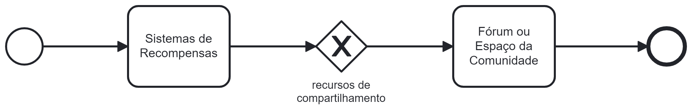

### 3.3.6 Processo 6 – *FeedBack dos profissionais :*

Descrição: Este processo visa aprimorar a motivação dos usuários por meio de um sistema de feedbacks, promover a interação entre os usuários e criar um senso de comunidade através de recursos de compartilhamento e espaços de discussão onde possam deixar uma avaliação de algumas interações que tiveram com os profissionais. 

#### Detalhamento das atividades

  Atividade 1- Incorporar um sistema de Feedbacks para avaliar os profissionais .
  
  Atividade 2 - Oferecer recursos de compartilhamento para que os usuários possam mostrar suas experiencias.
  
  Atividade 3 - Criar um fórum ou espaço para a comunidade onde os usuários possam trocar dicas, experiências e motivação.

Os tipos de dados a serem utilizados são:

* **Área de texto** - campo texto de múltiplas linhas
* **Caixa de texto** - campo texto de uma linha
* **Número** - campo numérico
* **Data** - campo do tipo data (dd-mm-aaaa)
* **Hora** - campo do tipo hora (hh:mm:ss)
* **Data e Hora** - campo do tipo data e hora (dd-mm-aaaa, hh:mm:ss)
* **Imagem** - campo - contendo uma imagem
* **Seleção única** - campo com várias opções de valores que são mutuamente exclusivos (tradicional radio button ou combobox)
* **Seleção múltipla** - campo com várias opções que podem ser selecionadas mutuamente (tradicional checkbox ou listbox)
* **Arquivo** - campo de upload de documento
* **Link** - campo que armazena uma URL
* **Tabela** - campo formado por uma matriz de valores

**Nome da atividade 1**

| **Campo**       | **Tipo**         | **Restrições** | **Valor default** |
| ---             | ---              | ---            | ---               |
| [Nome do campo] | [tipo de dados]  |                |                   |
| ***Exemplo:***  |                  |                |                   |
| login           | Caixa de Texto   | formato de e-mail |                |
| senha           | Caixa de Texto   | mínimo de 8 caracteres |           |

| **Comandos**         |  **Destino**                   | **Tipo** |
| ---                  | ---                            | ---               |
| [Nome do botão/link] | Atividade/processo de destino  | (default/cancel/  ) |
| ***Exemplo:***       |                                |                   |
| entrar               | Fim do Processo 1              | default           |
| cadastrar            | Início do proceso de cadastro  |                   |

**Nome da atividade 2**

| **Campo**       | **Tipo**         | **Restrições** | **Valor default** |
| ---             | ---              | ---            | ---               |
| [Nome do campo] | [tipo de dados]  |                |                   |
|                 |                  |                |                   |

| **Comandos**         |  **Destino**                   | **Tipo**          |
| ---                  | ---                            | ---               |
| [Nome do botão/link] | Atividade/processo de destino  | (default/cancel/  ) |
|                      |                                |                   |
